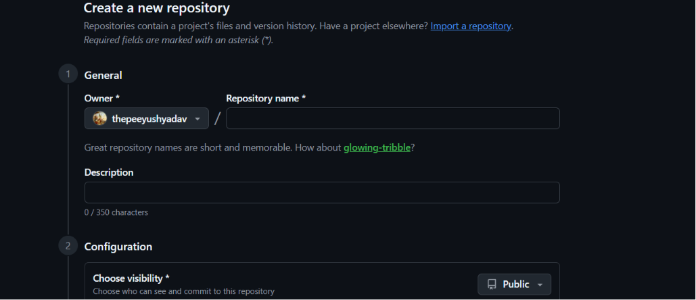

# 🪄 Offline AI Image Upscaler



An offline, easy-to-use AI Image Upscaler built with Python and Streamlit. It uses the powerful **Real-ESRGAN** model to upscale and enhance blurry or low-resolution images by 4x. The application is fully optimized for local execution with GPU acceleration (CUDA) support for blazing-fast inference, even on laptop GPUs (like the RTX 3050).

**Developed by: Piyush**

---

## ✨ Features

- **100% Offline:** No cloud APIs or internet connection required after the initial model download.
- **AI-Powered Upscaling:** Utilizes the state-of-the-art `RealESRGAN_x4plus` model for high-quality image enhancement.
- **GPU Acceleration (CUDA):** Automatically detects and utilizes NVIDIA GPUs for fast processing, bypassing heavy CPU loads.
- **Memory Optimized (Tiling):** Includes dynamic image tiling to prevent Out-Of-Memory (OOM) errors on systems with limited VRAM (e.g., 4GB or 6GB GPUs).
- **Interactive UI:** A beautiful and simple web interface built with Streamlit.
- **Side-by-Side Comparison:** View original and upscaled images with dimensions before downloading.

## 🚀 Installation & Setup

### Prerequisites
- Python 3.8 or newer.
- An NVIDIA GPU (highly recommended for speed) with updated drivers.
- [CUDA Toolkit](https://developer.nvidia.com/cuda-downloads) installed if you wish to use GPU acceleration.

### 1. Clone the repository

```bash
git clone https://github.com/yourusername/offline-ai-image-upscaler.git
cd "offline-ai-image-upscaler"
```

### 2. Install Dependencies

Install the required Python packages. If you have an NVIDIA GPU, make sure to install the CUDA version of PyTorch for the best performance.

```bash
# Install PyTorch with CUDA support (Example for CUDA 12.1)
pip install torch torchvision torchaudio --index-url https://download.pytorch.org/whl/cu121

# Install the rest of the requirements
pip install -r requirements.txt
```

### 3. Run the Application

Start the Streamlit server:

```bash
streamlit run app.py
```

The application will open in your default web browser at `http://localhost:8501`.

## 🛠️ Built With

- [Streamlit](https://streamlit.io/) - For the beautiful frontend web interface.
- [Real-ESRGAN](https://github.com/xinntao/Real-ESRGAN) - For the core AI upscaling algorithms.
- [PyTorch](https://pytorch.org/) - For running the deep learning models.
- [OpenCV](https://opencv.org/) & [Pillow](https://python-pillow.org/) - For image processing.

## 📝 License

This project is open-source and available under the [MIT License](LICENSE).
